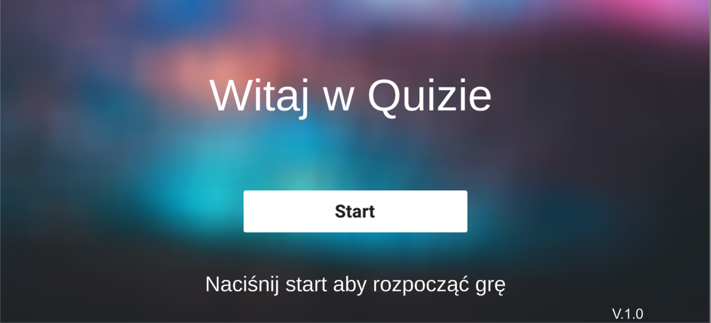
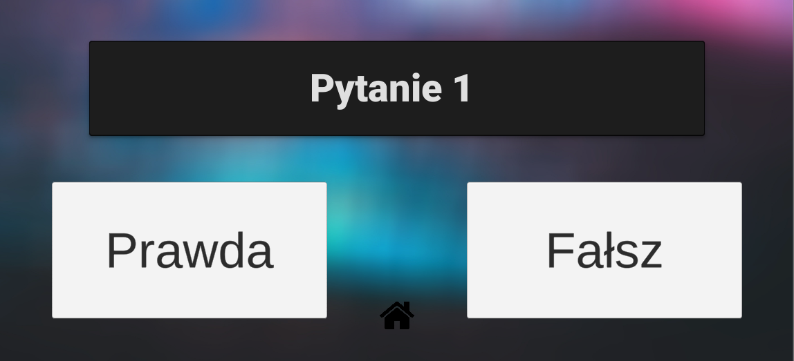
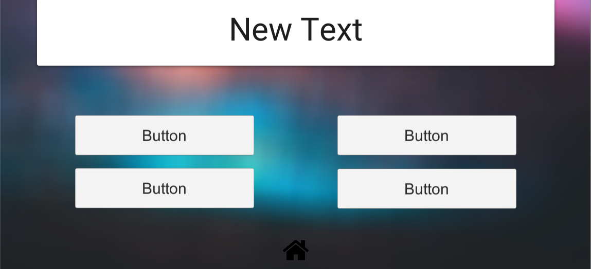

<h1>INTERAKTYWNY QUIZ JAKO FORMA UNOWOCZEŚNIENIA DYDAKTYKI</h1>

<h2>Program typu quiz umożliwiający rozgrywkę jednoosobową oraz w trybie sieciowym</h2>
Zestawy pytań i odpowiedzi mogą zostać wgrane przez prowadzącego za pomocą arkusza kalkulacyjnego umieszczonego w chmurze. W grze występują dwa rodzaje pytań, na które użyt-kownik może udzielić odpowiedzi, są to pytania typu prawda-fałsz oraz pytania z 4 możliwymi odpowiedziami, z których zawsze jedna jest poprawna. Aplikacja obsługuje również dwa tryby gry: jednoosobowy oraz wieloosobowy. W trybie gry sieciowej każdy z uczestników może od-powiedzieć na zadane pytanie bezpośrednio z aplikacji na swoim telefonie a na koniec rozgryw-ki na ekranie podsumowującym quiz zobaczyć wyniki swoje oraz pozostałych użytkowników. Użytkownik podłączając się do pokoju gry może wybrać, czy chce pozostać anonimowy lub podać nazwę, jaka będzie używana przez niego w grze. Tryb jednoosobowy posiada identyczny system gry jak tryb wieloosobowy. 

Przy realizacji projektu posłużono się : językiem C#, silnikiem graficznym Unity, oprogramowaniem Xcode, środowiskiem Microsoft Visual Studo, systemem baz danych Fire-base oraz bibliotekami unity: Photon, Quick-sheet, Rest-client. 

<h3>

      <a href="https://youtu.be/C2PCUH7MYb8">
            Film przedstawiający użycie programu 
      </a>
      </h3>

<h2>Zdjęcia poglądowe programu</h2> 
      
Ekran startowy 

Dwa tryby rozgrywki 

